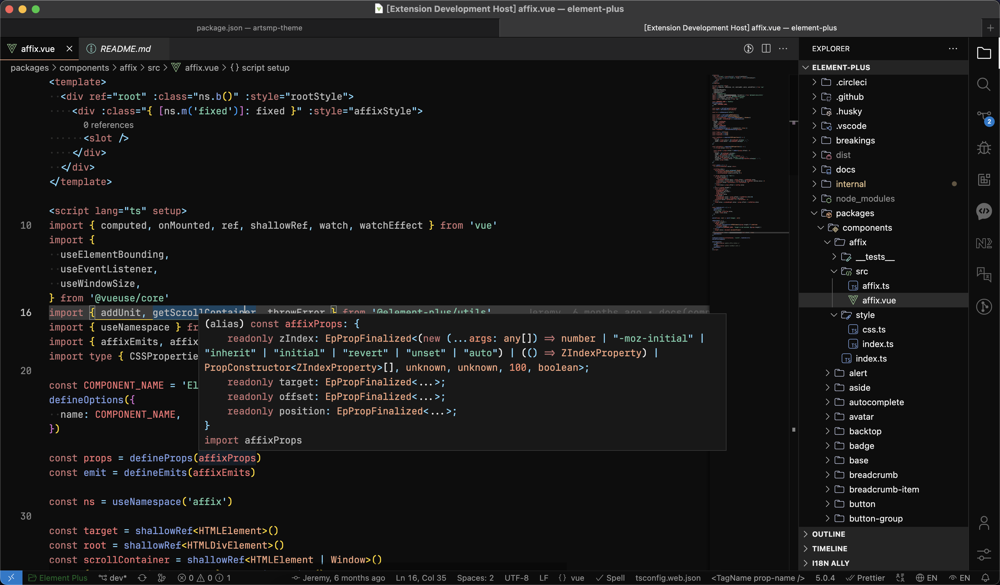

<h1 align="center">Artsmp Dark Theme for VS Code</h1>

<samp>&nbsp;&nbsp;&nbsp;&nbsp;&nbsp;&nbsp;&nbsp;Font | <a href="https://www.jetbrains.com/lp/mono/">JetBrains Mono</a> 
&nbsp;File Icons | <a href="https://marketplace.visualstudio.com/items?itemName=Catppuccin.catppuccin-vsc-icons">Catppuccin Icons for VSCode</a> 
Product Icons | <a href="https://github.com/antfu/vscode-icons-carbon">Carbon</a>&nbsp;&nbsp;&nbsp;&nbsp;&nbsp;&nbsp; 
&nbsp;&nbsp;&nbsp;&nbsp;&nbsp;&nbsp;&nbsp;&nbsp;&nbsp;&nbsp;Demo | <a href="https://github.com/element-plus/element-plus">Element Plus</a>&nbsp;&nbsp;&nbsp;&nbsp;&nbsp;&nbsp;</samp>

## Thanks

This project is based on [material-dark-vscode](https://github.com/xrei/material-dark-vscode).
